# Autoencoder Summary

Autoencoder is useful in extracting latent representation of high dimensional data, and with latent space visualization, we can see how the original data is distributed with new learned features. Most importantly for my case, not with this dataset though, but with the images I'm currently working on at my company, this technique could be used to detect anomalies if together we implement clustering or other outlier techniques such as isolation forest or local outlier factor.

Before building autoencoder models, first let's take a look at how data points are distributed in high dimensional space. Use t-SNE(t-distributed Stochastic Neighbor Embedding) to help visualize high dimensional data.

We can see there are obvious clusters that separate digits apart from different ones, which indicates linear separability in high dimensional space. Next, let's see if autoencoders are able to do anything good to keep the clusters while compressing the data into only 2 dimensions.

First we compare model without hidden layers with those with single hidden layer of size 400 and 256 respectively.

No Hidden|400|256|
:---:|:---:|:---:|
|||
|||

Model with no hidden layers gives a very lossy result, while those with one hidden layer have better reconstructions, but still have a lot to improve, so I'll make this autoencoder deeper by adding one more layer, and compare the results again.

- 2 hidden layers:

400-256|256-128|
:---:|:---:|
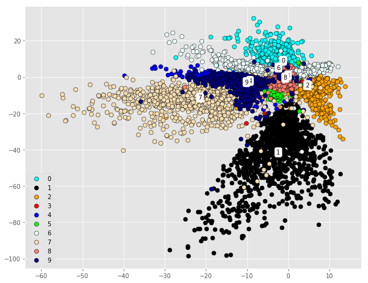||
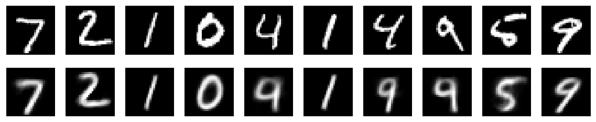|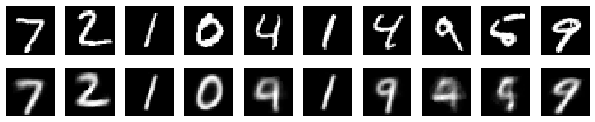|

- 3 hidden layers:

400-256-128|256-128-64|
:---:|:---:|
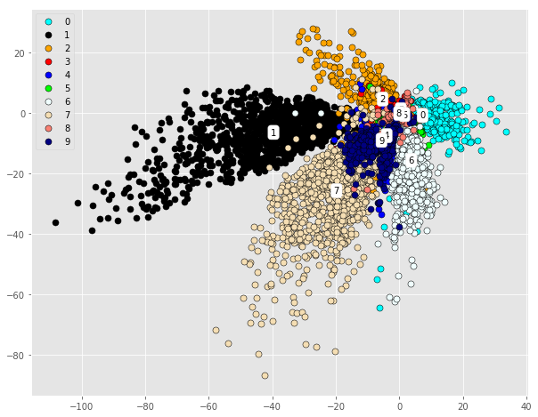|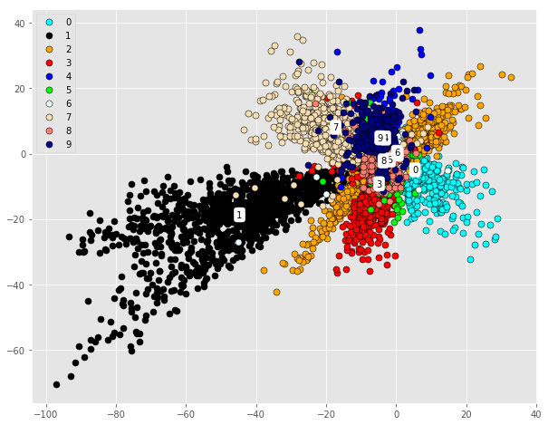|
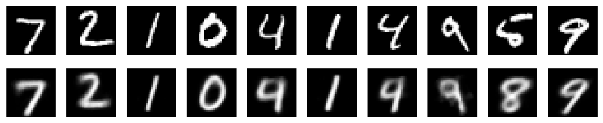|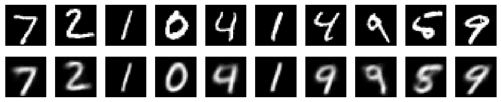|

- 4 hidden layers:

400-128-32-10|256-128-32-10|
:---:|:---:|
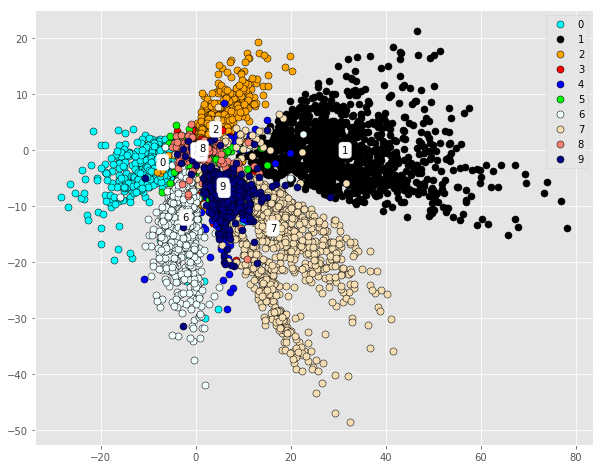|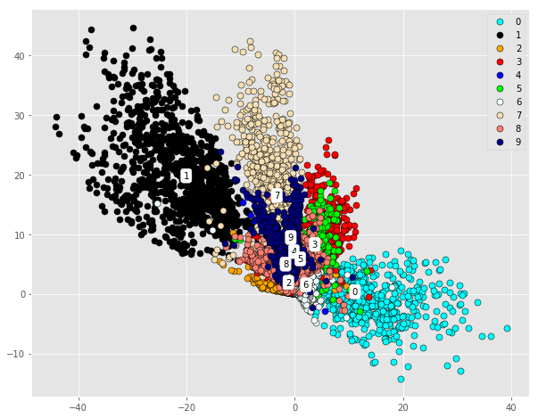|
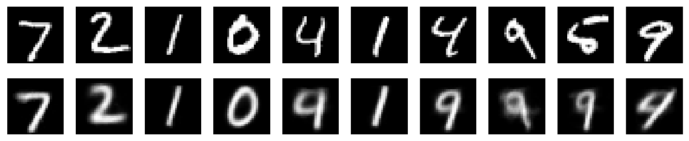|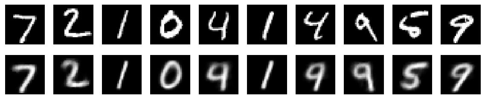|
