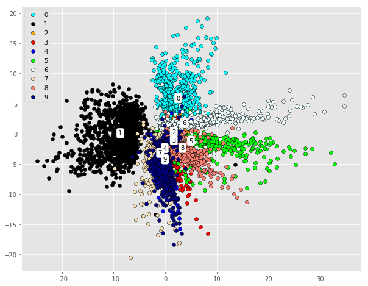
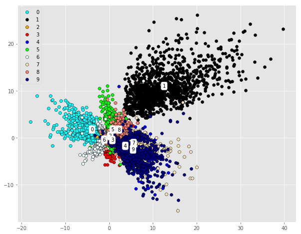
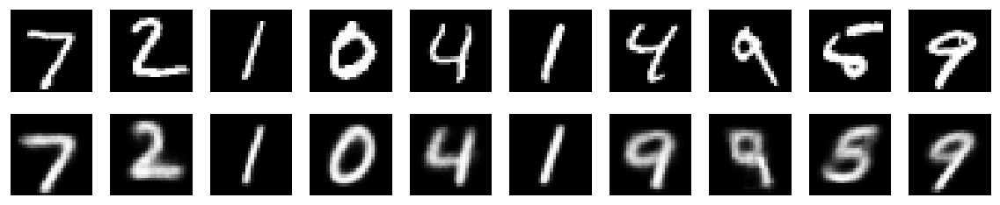
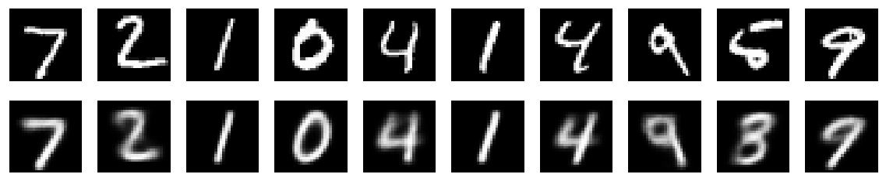
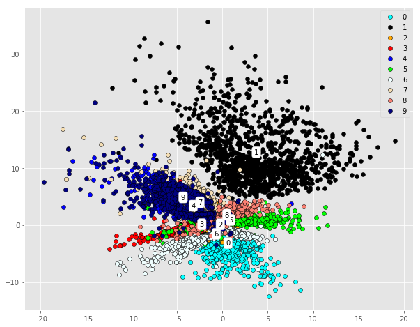
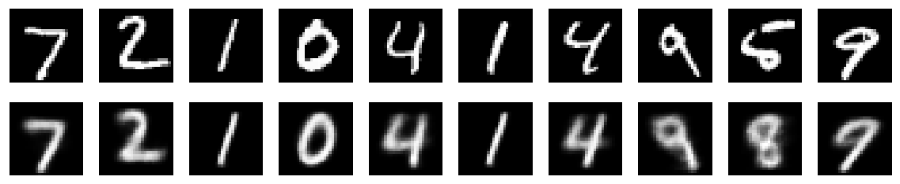
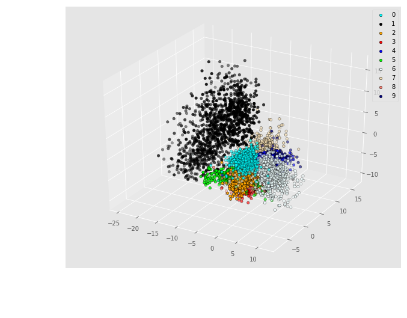
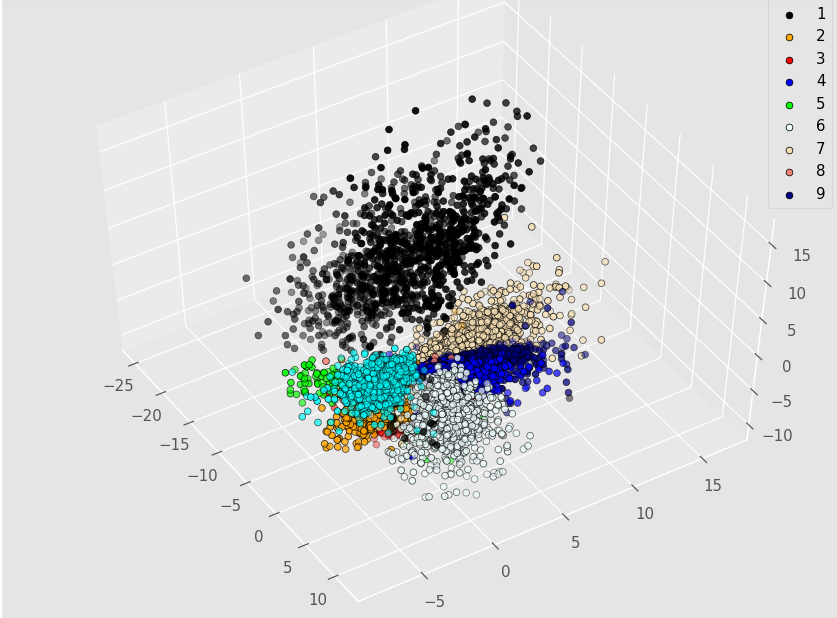
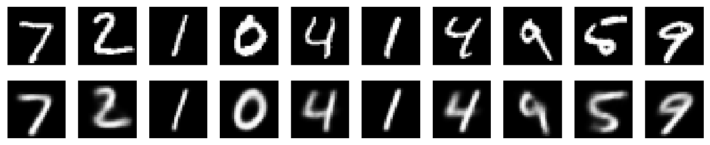

# Convolutional VAE Summary

Taking advantage of the fact that convolutional neural network is very powerful in extracting meaningful image features, convolutional variational autoencoder(ConvVAE) learns the probability representation of the original image data and aims to reconstruct or even generate new images by sampling from the learned probability distribution. However, tuning process of ConvVAE can be very cumbersome since it combines the hyperparameters of CNN and VAE. Followings are some of the hyperparameters I've tuned to see the effects they have in terms of reconstruction and latent variable modelling.

Parameters if not tuned:

`intermediate layers sizes = [1000,256]`
`no. of filters = [16,32]`
`KL divergence ratio = 0.000001`

- Different No. of Filters:

8,16|16,32|
:---:|:---:|
||
||

- Different Intermediate Layers Sizes

1000-256|1000-256-32|
:---:|:---:|
||
||

As we can see, ConvVAE performs a lot better than plain autoencoder and variational autoencoder while reconstructing 4 and 9, however, in latent space, they still overlap a lot and the results of clustering are still ideal, so I decide to take the latent space dimension up by 1, and visualize the data in 3D to see if the additional latent dimension helps learn more robust features.

|
|