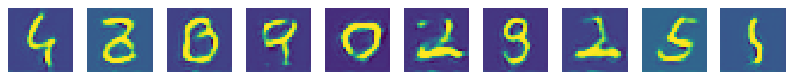

# Semi-Supervised Learning with Deep Convolutional Generative Adversarial Networks
Architecture:

Generative adversarial network(GAN in short) is a very interesting topic in deep learning nowadays, and its wide range of applications have been explored and proved to present incredible performance. In this notebook, I'm using DCGAN to implement semi-supervised learning, which only uses rather small number of labeled data but is able to learn robust features and generalize well on unseen data. As for why semi-supervised learning? In the real world, especially now and in the future, as more and more data is getting collected, some or even most of them will come without labels, and that's when semi-supervised learning comes in to play.

First, let's see how number of epochs can affect the learning process.

|20 epochs|
||
|100 epochs|
||

Obviously, with more iterations of training, the generator can reach better results in creating images from random Gaussian distributed variables.

Next comes to the main point of semi-supervised learning- how many labeled data we need to have the classifier perform well? Following is the accuracy of models trained with three different numbers of labeled data, all trained with 100 epochs.

|96(label rate=0.0016)|0.8712|
|960(label rate=0.016)|0.9614|
|9600(label rate=0.16)|0.9736|

Also the generated images of the above models

|96|(images/label_rate_0.0016_100.png)|
|960|(images/label_rate_0.016_100.png)|
|9600|(images/label_rate_0.16_100.png)|

With only 96 labeled data, the model is able to attain 87% accuracy from 10000 unseen images, and with less than 1000 labeled data, it's reached even higher accuracy as 96%. This is exactly the main spirit of semi-supervised learning, using very small number of labeled data to predict data with far larger size and with such a high accuracy too.

Resource:
[Original Paper](https://arxiv.org/pdf/1606.01583.pdf)
