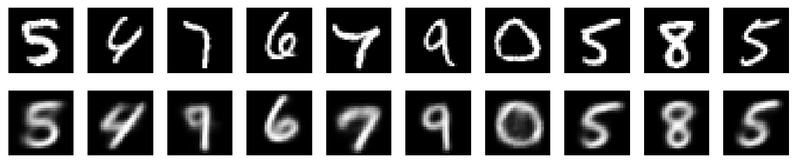
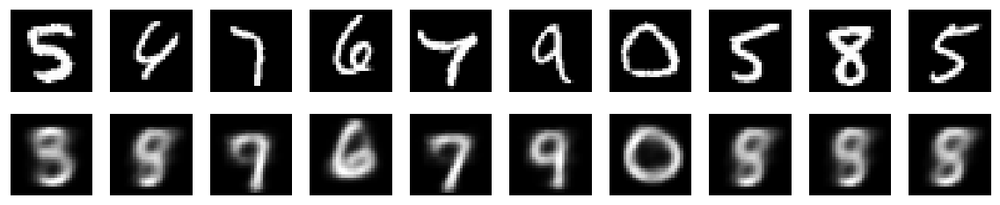
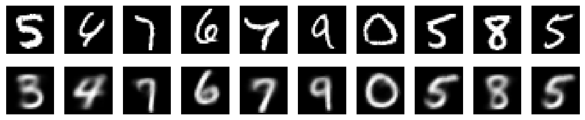
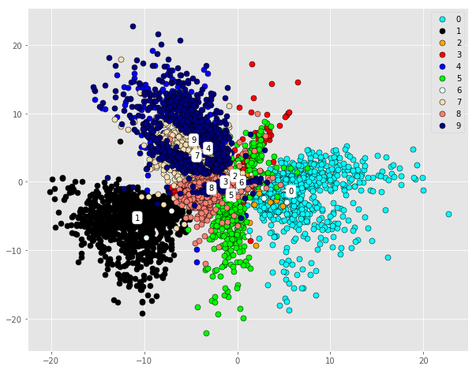
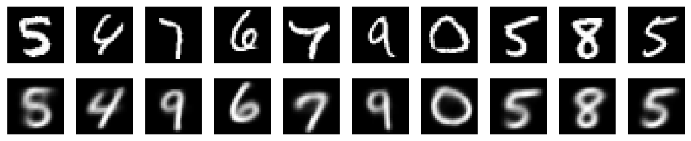
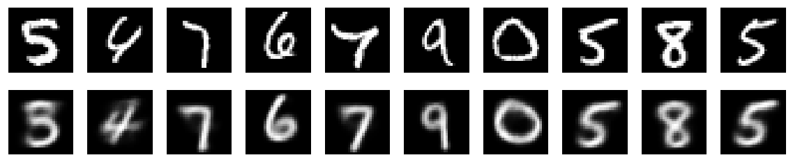

# VAE Summary

Rather than solely learning a deterministic compressed representation of the original data like autoencoders do, variational autoencoders learn the probabilistic representation of the data so it could be used to generate new data via sampling from learned probability distribution. Its structure is shown as follows:

I've tuned several parameters such as number of hidden layers, number of hidden nodes in each layer, and ratio of reconstruction loss and KL divergence loss to see how well vae learns the latent representation of mnist dataset with different hyperparameters.

First lets look at how KL-divergence affects the learning results:
(trained with single hidden layer of 400 nodes)

KL=0.5|KL=0.01|KL=0.0000001|
:---:|:---:|:---:|
|||
|||

KL divergence has a significance impact on how the latent variables are distributed, the larger the ratio of KL divergence loss is, the smaller the reconstruction loss ratio gets, the worse the reconstruction results are, and hence results in a more concentrated distribution with no obvious clusters appearing, namely, a disribution that approximates more to a normal distribution. 

Having seen the influence of KL divergence, next is the hidden layer size:
(trained with KL divergence ratio = 0.99999)

400-256-2|400-128-2|256-128-2|
:---:|:---:|:---:|
|||
|||

From the above figure, we can tell it's hard for this vae to distinguish sets such as (4,9) and (3,5,8) in only 2 dimensions because the clusters are heavily overlapped, with the rightmost(256-128-2) model also confused by 2 with (3,5,8). Reconstruction-wise, all three gives similar results to the images specified.

Finally, let's go deeper inside the vae:

400-256-2|400-256-64-2|400-256-64-10-2|
:---:|:---:|:---:|
|||
|||

