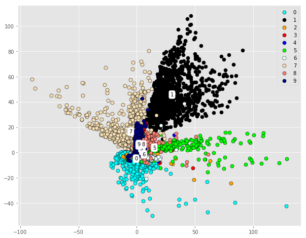
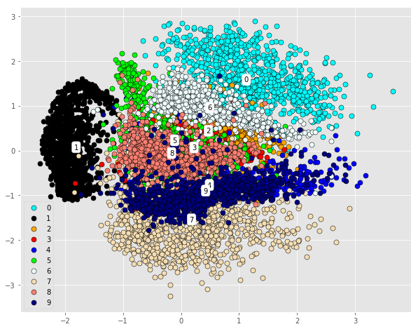
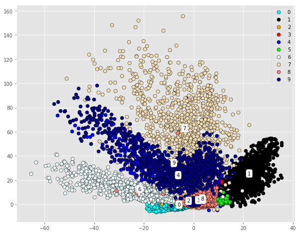

# VAE Summary

Rather than solely learning a deterministic compressed representation of the original data like autoencoders do, variational autoencoders learn the probabilistic representation of the data so it could be used to generate new data via sampling from learned probability distribution. Its structure is shown in the following figure:

I've tuned several parameters such as number of hidden layers, number of hidden nodes in each layer, and ratio of reconstruction loss and KL divergence loss to see how well vae learns the latent representation of mnist dataset with different hyperparameters.

First lets look at how KL-divergence affects the learning results:

KL-0.5|KL-0.99|KL-0.9999999|
:---:|:---:|:---:|
|||
